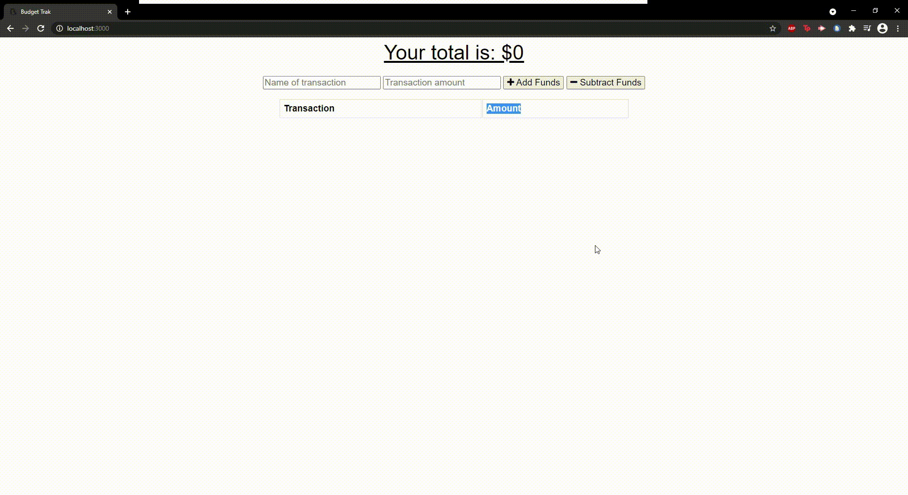

# BudgetTrak

## Table of Contents

1. [About](#about)
1. [Pictures/Gif of Application](#pictures/gif-of-application)
1. [Live Application](#live-application)
1. [Getting Started](#getting-started)
1. [License](#license)

---------------------------	

## About
Budget Trak is an application that anyone can use. The application tracks the users personal finances. 
When the user enters the application, they are presented with an option with inputing an entry. The user
can name the transaction as well as the transactions amount. The user can then choose to either add those funds
or to subtract those funds, depending on what the user wants to do. The transactions and the amounts are then logged 
on a list. They are also logged on graph so the user can see examine their spending habbits. The application also 
tells the user what their total is on the top of the application

---------------------------

## Live Application

You can find the live application here: 

https://pure-castle-20532.herokuapp.com/

---------------------------

## Pictures/Gif of Application

---------------------------	

## Getting Started 
Before you start, you need a few things:
* Service-worker
* Manifest.webmainfest
* NPM express
* Compression
* Mongoose

---------------------------	

## License

MIT License

Copyright (c) 2021 Evan Chu

Permission is hereby granted, free of charge, to any person obtaining a copy
of this software and associated documentation files (the "Software"), to deal
in the Software without restriction, including without limitation the rights
to use, copy, modify, merge, publish, distribute, sublicense, and/or sell
copies of the Software, and to permit persons to whom the Software is
furnished to do so, subject to the following conditions:

The above copyright notice and this permission notice shall be included in all
copies or substantial portions of the Software.

THE SOFTWARE IS PROVIDED "AS IS", WITHOUT WARRANTY OF ANY KIND, EXPRESS OR
IMPLIED, INCLUDING BUT NOT LIMITED TO THE WARRANTIES OF MERCHANTABILITY,
FITNESS FOR A PARTICULAR PURPOSE AND NONINFRINGEMENT. IN NO EVENT SHALL THE
AUTHORS OR COPYRIGHT HOLDERS BE LIABLE FOR ANY CLAIM, DAMAGES OR OTHER
LIABILITY, WHETHER IN AN ACTION OF CONTRACT, TORT OR OTHERWISE, ARISING FROM,
OUT OF OR IN CONNECTION WITH THE SOFTWARE OR THE USE OR OTHER DEALINGS IN THE
SOFTWARE.

---------------------------	